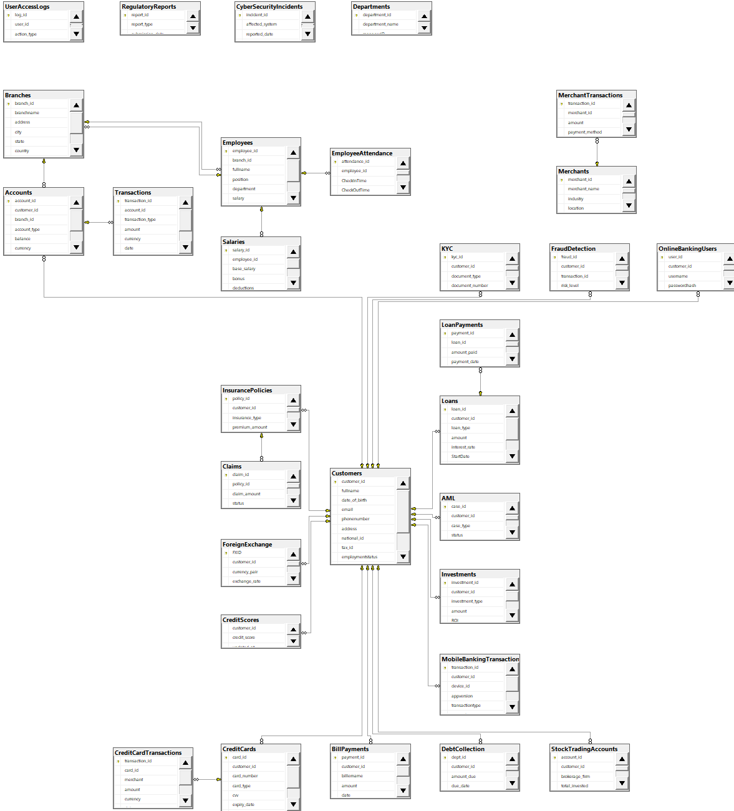

# bank-database-sql

## Overview

Designed and implemented a banking database system in SQL Server consisting of 30 interconnected tables covering core banking operations, loans, fraud detection, compliance, investments, insurance, and merchant transactions.

## Features

- 30-table relational database schema
- Primary and foreign key constraints
- Customer and account management
- Loan and credit management
- Fraud detection analytics
- Compliance and risk monitoring
- Investment and insurance modules

## Methods

- SQL Server
- SQL
- Database Design
- Data Modeling

## Sample Analytics

- Top account balances
- Active loan monitoring
- High-risk fraud transaction detection
- Branch-level loan exposure analysis
- Suspicious transaction pattern detection

## Setup & Usage:

## Setup
- Run `schema.sql` in SQL Server to create all 30 tables
- Ensure SQL Server is installed and running

## Usage
- Example query 1: Top 3 accounts by balance
```sql
SELECT TOP 3 * FROM Accounts 
ORDER BY Balance DESC

-Example query 2: Customers with more than 1 active loan
SELECT Customer_ID, COUNT(*) AS Active_Loan 
FROM Loans
WHERE Status = 'Active'
GROUP BY Customer_ID
HAVING COUNT(*) > 1

- Example query 3: Transactions flagged in FraudDetection
SELECT 
    t1.Transaction_ID,
    t1.Account_ID,
    t1.Transaction_Type, 
    t1.Amount,
    t1.Currency,
    t1.Date,
    t1.ReferenceNo, 
    dt.Fraud_ID,
    dt.Customer_ID, 
    dt.Risk_Level, 
    dt.Reported_Date 
FROM Transactions t1 
JOIN (
    SELECT * FROM FraudDetection 
    WHERE Risk_Level IN ('High','Critical','Medium')
) dt ON t1.Transaction_ID = dt.Transaction_ID;

- Example query 4: Total loan amount per branch (excluding Paid)
;WITH cte AS (
    SELECT l.Loan_ID, l.Status, l.Amount, a.Branch_ID 
    FROM Loans l 
    JOIN Accounts a ON l.Customer_ID = a.Customer_ID
    WHERE l.Status != 'Paid'
)
SELECT Branch_ID, SUM(Amount) AS Total_Loan_Amount 
FROM cte 
GROUP BY Branch_ID 
ORDER BY Branch_ID;

- Example query 5: Suspicious transactions within 60 minutes

;WITH cte AS (
    SELECT t.Transaction_ID, t.Amount, t.Date,
           a.Account_ID, c.Customer_ID 
    FROM Transactions t 
    JOIN Accounts a ON t.Account_ID = a.Account_ID 
    JOIN Customers c ON c.Customer_ID = a.Customer_ID
)
SELECT t1.Customer_ID, t1.Transaction_ID, t1.Amount,
       DATEDIFF(MINUTE, t1.Date, t2.Date) AS Diff_Minutes
FROM cte t1 
JOIN cte t2 ON t1.Account_ID = t2.Account_ID 
           AND t1.Transaction_ID != t2.Transaction_ID
WHERE ABS(DATEDIFF(MINUTE, t1.Date, t2.Date)) <= 60 
  AND t1.Amount > 10000 
  AND t2.Amount > 10000;


## Database Schema Diagram

